# 📊 Financial Performance Dashboard – F68 Finance (Power BI)
---
Tác giả: Dương Chí Tuấn   
Thời gian thực hiện: Tháng 3 2026  
Công cụ sử dụng: Power BI
---
## 📑 Mục lục
1. 📌 Ngữ cảnh
2. 📂 Giải pháp
3. 🧠 Xác định dữ liệu đầu vào
4. 📊Triển khai
---

## 📌 Ngữ cảnh
Ban lãnh đạo công ty F68 Finance có nhu cầu theo dõi hiệu quả kinh doanh nhằm đánh giá tổng thể tình hình tài chính và hiệu quả hoạt động của doanh nghiệp, theo dõi kết quả kinh doanh theo từng khu vực trong mạng lưới cũng như toàn doanh nghiệp theo từng tháng, đồng thời đo lường và so sánh hiệu suất kinh doanh của từng ASM. Từ đó, một dashboard theo dõi kết quả kinh doanh được xây dựng nhằm trực quan hóa các chỉ số quan trọng, hỗ trợ ban lãnh đạo theo dõi, đánh giá và ra quyết định quản lý hiệu quả hơn.
## 📂 Giải pháp
Để đáp ứng nhu cầu theo dõi và đánh giá hiệu quả kinh doanh của ban lãnh đạo, một hệ thống dashboard được xây dựng nhằm trực quan hóa các chỉ số tài chính và hiệu quả hoạt động của doanh nghiệp dưới nhiều góc nhìn khác nhau. Hệ thống này giúp ban lãnh đạo có thể theo dõi tình hình kinh doanh ở cấp độ tổng thể, theo từng khu vực, cũng như đánh giá hiệu suất làm việc của các ASM.  

### Hệ thống bao gồm các dashboard sau:

- **Báo cáo KQKD**  
  Dashboard này trình bày bảng tổng hợp các chỉ tiêu kinh doanh và chi phí của toàn doanh nghiệp. Dữ liệu được phân tách theo từng khu vực trong mạng lưới như Đông Nam Bộ, Đồng bằng sông Hồng,… giúp ban lãnh đạo theo dõi và so sánh kết quả hoạt động giữa các khu vực.

- **Tổng quan**  
  Dashboard này cung cấp góc nhìn tổng thể về tình hình tài chính của doanh nghiệp thông qua các chỉ số quan trọng như lợi nhuận, thu nhập,... Qua đó giúp ban lãnh đạo nhanh chóng đánh giá “sức khỏe” chung của doanh nghiệp và xu hướng biến động theo thời gian.

- **Hiện trạng các khu vực**  
  Dashboard này tập trung thể hiện các chỉ tiêu kinh doanh dưới góc nhìn khu vực. Các chỉ số được trình bày theo từng khu vực trong hệ thống nhằm hỗ trợ việc so sánh hiệu quả hoạt động, xác định khu vực hoạt động tốt hoặc cần cải thiện.

- **Bảng xếp hạng ASM**  
  Dashboard này trình bày bảng xếp hạng các ASM dựa trên các chỉ tiêu đánh giá hiệu quả công việc. Thông qua đó, ban lãnh đạo có thể theo dõi và so sánh hiệu suất làm việc giữa các ASM, hỗ trợ cho việc đánh giá, quản lý và phân bổ nguồn lực.

## 🧠 Xác định dữ liệu đầu vào
Dựa trên các dashboard đã thiết kế, bước tiếp theo là xác định các nguồn dữ liệu đầu vào cần thiết để xây dựng các chỉ tiêu và báo cáo. Các dữ liệu này được thu thập từ nhiều đơn vị trong doanh nghiệp nhằm đảm bảo cung cấp đầy đủ thông tin phục vụ cho việc tính toán và trực quan hóa các chỉ số kinh doanh trên dashboard.  

### Cụ thể, các bảng dữ liệu đầu vào bao gồm:

- **fact_kpi_month**  
  Chứa thông tin về các hồ sơ khách hàng theo tháng.  
  **Đơn vị cung cấp:** Phòng TCKH  
  **Mục đích sử dụng:** Phục vụ cho các dashboard *Báo cáo KQKD*, *Tổng quan* và *Hiện trạng theo khu vực*.

- **fact_txn_month**  
  Chứa thông tin giao dịch của các tài khoản GL theo tháng, phản ánh các khoản thu nhập, chi phí và các biến động tài chính liên quan.  
  **Đơn vị cung cấp:** Phòng Kế toán  
  **Mục đích sử dụng:** Phục vụ cho các dashboard *Báo cáo KQKD*, *Tổng quan* và *Hiện trạng theo khu vực*.

- **fact_kpi_asm**  
  Chứa thông tin về kết quả kinh doanh và các chỉ tiêu đánh giá hiệu quả làm việc của các ASM.  
  **Đơn vị cung cấp:** Phòng PTKD  
  **Mục đích sử dụng:** Phục vụ cho dashboard *Bảng xếp hạng ASM*.

## 📊Triển khai

Quá trình xử lý dữ liệu được thực hiện trên PostgreSQL thông qua công cụ DBeaver trước khi kết nối với Power BI. 
Dữ liệu từ các bảng nguồn được tiếp nhận, chuẩn hóa và tổ chức lại thành các bảng dimension và fact phục vụ cho việc xây dựng dashboard.

### Bước 1.  Thu thập nguồn dữ liệu

Hệ thống sử dụng các bảng dữ liệu nguồn sau:

- **fact_kpi_month**: Lưu trữ thông tin hồ sơ và các chỉ tiêu kinh doanh theo tháng.  
- **fact_txn_month**: Lưu trữ thông tin giao dịch của các tài khoản GL, phản ánh các khoản thu nhập và chi phí.  
- **fact_kpi_asm**: Lưu trữ kết quả kinh doanh và các chỉ số đánh giá hiệu quả làm việc của các ASM.

### Bước 2. Xây dựng các bảng dữ liệu
Từ các bảng dữ liệu nguồn, các bảng dữ liệu trung gian và bảng tổng hợp được xây dựng nhằm chuẩn hóa cấu trúc dữ liệu và phục vụ cho việc xây dựng báo cáo.   

- **dim_area:** Bảng lưu trữ thông tin về các khu vực trong hệ thống, được sử dụng để liên kết dữ liệu giữa các bảng theo từng khu vực.

  <kbd>
  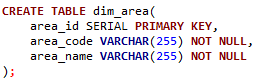
  </kbd>

- **dim_funding_structure:** Bảng lưu trữ danh mục các chỉ tiêu tài chính trong báo cáo và cấu trúc phân cấp giữa các chỉ tiêu.
  
  <kbd>
  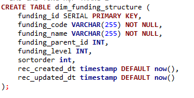
  </kbd>   

Sau khi xây dựng các bảng dimension, dữ liệu từ ba bảng nguồn được kết hợp với các bảng dimension vừa tạo để tiến hành tổng hợp và xây dựng các bảng dữ liệu phục vụ báo cáo.
Quá trình này được thực hiện thông qua stored procedure, cho phép xử lý và tổng hợp dữ liệu theo từng kỳ báo cáo, đồng thời hỗ trợ cơ chế **backdate** để có thể chạy lại dữ liệu cho các khoảng thời gian trong quá khứ khi cần thiết.   

#### Stored Procedure rpt_summary_month_prc  

Procedure này tổng hợp các chỉ số đánh giá hiệu quả làm việc của từng ASM theo từng tháng và lưu vào bảng **fact_report_asm**.  

<kbd>
  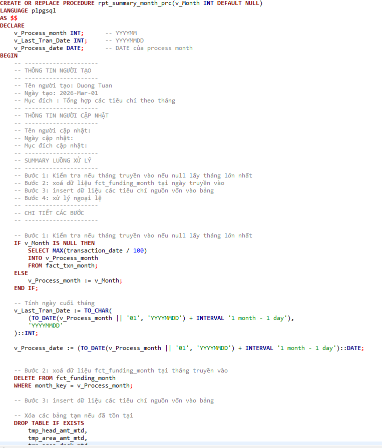
</kbd>   

#### Stored Procedure rpt_asm_ranking_month_prc  

Procedure này tổng hợp dữ liệu từ các bảng giao dịch và KPI theo từng khu vực và từng tháng để xây dựng bảng **fct_funding_month**.  

<kbd>
  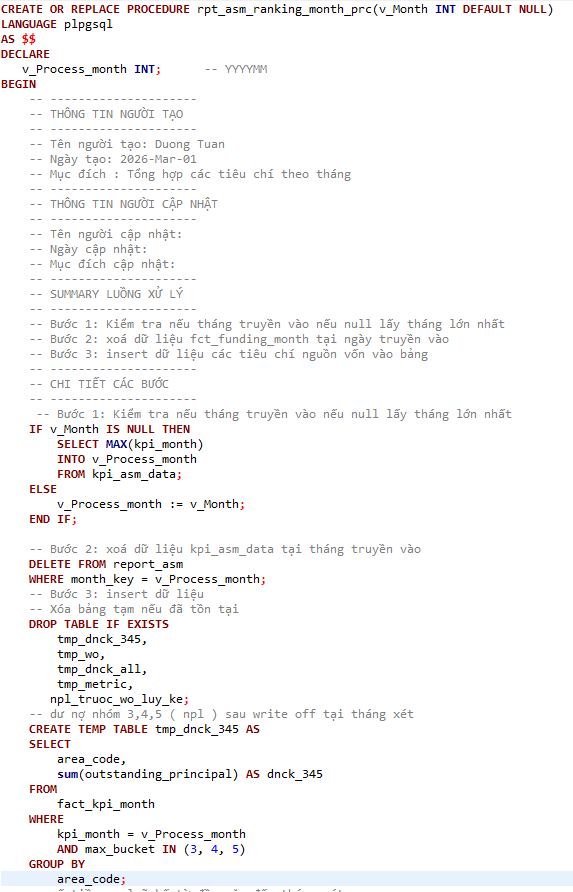
</kbd>    

Kết quả của quá trình xử lý này là hai bảng dữ liệu chính:

- **fct_funding_month**: Lưu trữ giá trị các chỉ tiêu tài chính theo từng khu vực và từng tháng.

<kbd>
  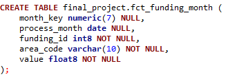
</kbd>   

- **fact_report_asm**: Lưu trữ các chỉ số đánh giá hiệu quả làm việc của từng ASM theo từng tháng.
<kbd>
  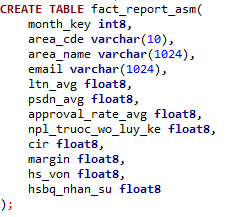
</kbd>

### Bước 3. Xây dựng dashboard   
#### Trang Báo cáo KQKD
<kbd>
  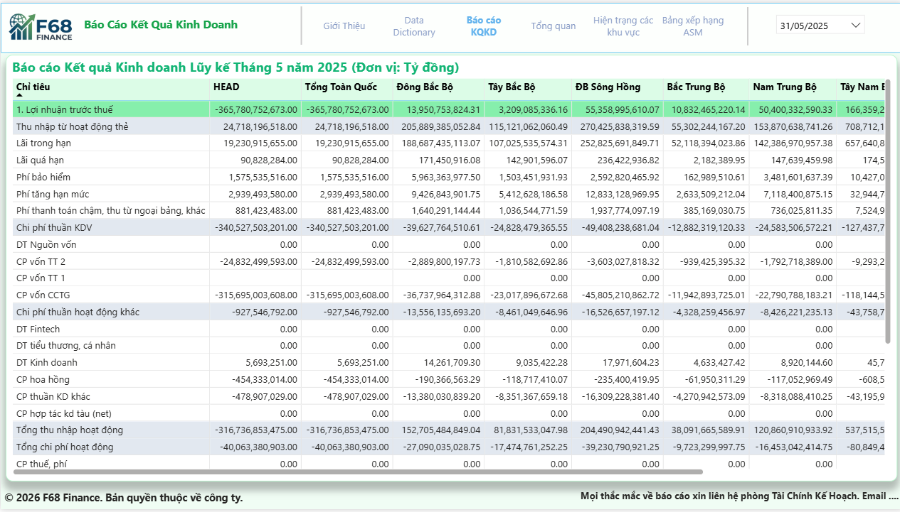
</kbd>   

**Mục tiêu thiết kế**   
- Hệ thống hàng (Chỉ tiêu tài chính): Tôi liệt kê đầy đủ các khoản mục từ Lợi nhuận trước thuế, các loại thu nhập (lãi vay, phí bảo hiểm...) đến các tầng chi phí (vốn, vận hành, thuế phí). Việc sắp xếp từ trên xuống dưới giúp người xem theo dõi được dòng chảy tài chính từ Doanh thu xuống đến Lợi nhuận cuối cùng.
- Hệ thống cột (Phân mảnh khu vực): Điểm đặc biệt ở trang này là các cột khu vực (Đông Bắc Bộ, Tây Bắc Bộ, Sông Hồng...). Tôi thiết kế như vậy để người xem có cái nhìn so sánh song song. Chỉ cần nhìn ngang một hàng, người xem sẽ biết ngay chỉ tiêu đó ở vùng nào đang làm tốt nhất và vùng nào đang yếu.

#### Trang Tổng quan
<kbd>
  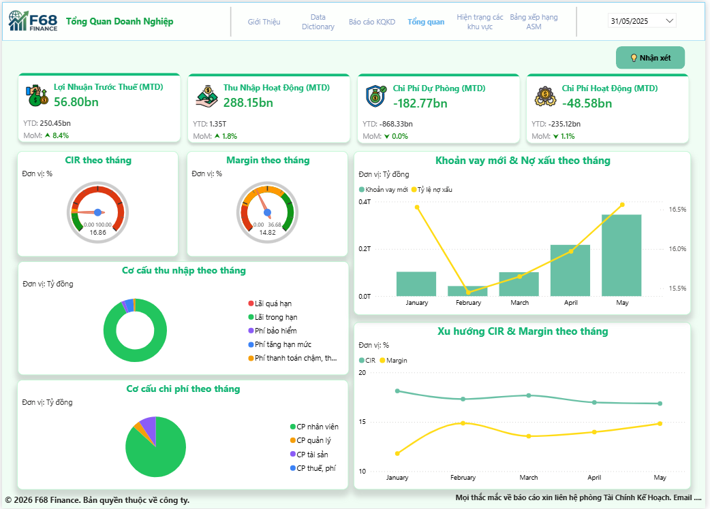
</kbd>   

**Mục tiêu thiết kế**
- Hàng chỉ số trên cùng: Tôi đặt 4 con số quan trọng nhất (Lợi nhuận, Thu nhập, Dự phòng, Chi phí) ngay trên cửa sổ chính. Đây là 'bảng điều khiển' trung tâm, nhìn vào là biết tháng này mình làm ăn hiệu quả hay không nhờ các mũi tên so sánh với tháng trước."
- Cụm bên trái (Hiệu suất): Khu vực này tôi dùng biểu đồ đồng hồ (Gauge) để thể hiện chỉ số CIR và Margin. Cách này trực quan hơn bảng biểu vì sếp thấy ngay kim đang chỉ vào vùng xanh hay vàng, tức là mình đang vận hành tối ưu hay cần điều chỉnh chi phí ngay lập tức."
- Cụm bên phải (Câu chuyện tăng trưởng): Đây là phần tôi dành diện tích lớn nhất. Tôi kết hợp giữa Vay mới và Nợ xấu trên cùng một biểu đồ để theo dõi được tính bền vững. Ý đồ của tôi là: Tăng trưởng (Vay mới) phải đi đôi với kiểm soát rủi ro (Nợ xấu). Nếu cột xanh cao mà đường vàng cũng vọt lên thì đó là tín hiệu cảnh báo.
- Khu vực chân trang: Tôi để thông tin liên hệ và bản quyền rất gọn ở cuối để tránh làm phân tâm, nhưng vẫn đầy đủ để khi cần sếp có thể liên hệ ngay bộ phận hỗ trợ.

**Nhận xét**
- Tối ưu hóa quản trị chi phí: Lợi nhuận trước thuế (MTD) ghi nhận mức tăng trưởng mạnh 8.4%, vượt xa tốc độ tăng trưởng của Thu nhập hoạt động (1.8%). Sự chênh lệch này cho thấy hiệu quả rõ rệt trong việc kiểm soát các khoản chi phí vận hành (Operating Expense giảm 1.1% MoM), giúp doanh nghiệp gia tăng đáng kể lợi nhuận ròng dù doanh thu chỉ tăng nhẹ.
- Tương quan giữa Tăng trưởng & Rủi ro: Quy mô giải ngân (Khoản vay mới) trong tháng 5 đạt mức cao nhất trong vòng 5 tháng. Tuy nhiên, tỷ lệ nợ xấu (vàng) cũng đang có xu hướng gia tăng liên tục từ tháng 2 đến nay (chạm mức ~16.8%). Đây là dấu hiệu cho thấy chất lượng phê duyệt hồ sơ đang chịu áp lực từ tốc độ mở rộng quy mô quá nhanh.
- Chỉ số hiệu quả (CIR & Margin): Chỉ số CIR 16.86% và Margin 14.82% đang duy trì ở mức rất tốt. Biểu đồ xu hướng cho thấy sự cải thiện đồng bộ: CIR giảm dần trong khi Margin tăng dần qua các tháng, phản ánh khả năng sinh lời trên mỗi đồng vốn đang được tối ưu hóa liên tục.
- Về quy mô: Việc giải ngân bùng nổ trong tháng 5 giúp mở rộng thị phần nhưng cần đặc biệt lưu ý hệ quả nợ xấu có thể phát sinh trong các kỳ tới.
- Về nguồn thu: Thu nhập hiện tại vẫn phụ thuộc trọng yếu vào dự nợ lãi vay (Lãi trong hạn). Các mảng thu nhập dịch vụ (Phí bảo hiểm, Phí dịch vụ) còn chiếm tỷ trọng thấp, chưa tạo được sự đa dạng hóa cần thiết để ứng phó với biến động thị trường.
- Về cấu trúc phí: Chi phí nhân sự vẫn là khoản mục lớn nhất, cho thấy tiềm năng vẫn còn rất lớn trong việc ứng dụng công nghệ để cắt giảm các quy trình thủ công và tối ưu năng suất lao động.
- Kết quả kinh doanh tháng 5/2023 rất khả quan về mặt số số tuyệt đối (Lợi nhuận 56.8 tỷ) nhờ khả năng kiểm soát chi phí xuất sắc.
- Tuy nhiên, xu hướng nợ xấu tăng tỷ lệ thuận với doanh số giải ngân mới là tín hiệu cảnh báo cần sự can thiệp sớm của bộ phận quản trị rủi ro.

**Đề xuất giải pháp**
- Cần chuyển trọng tâm từ việc ưu tiên quy mô sang ưu tiên chất lượng giải ngân để bảo vệ thành quả kinh doanh bền vững.
- Kiểm soát chất lượng tín dụng: Rà soát lại tiêu chuẩn phê duyệt hồ sơ đối với các nhóm sản phẩm có tốc độ giải ngân cao trong tháng 4 và tháng 5. Điều chỉnh ngay các điều kiện cấp tín dụng đối với những địa bàn hoặc phân khúc khách hàng có tỷ lệ quá hạn vượt ngưỡng an toàn.
- Hệ thống cảnh báo và xử lý nợ sớm: Thiết lập cơ chế giám sát thời gian thực để kích hoạt đội ngũ nhắc nợ ngay từ ngày đầu tiên khách hàng chậm trả, đặc biệt chú trọng vào nhóm giải ngân mới tháng 5 để ngăn chặn nợ nhảy nhóm sâu.

#### Trang Hiện trạng các khu vực
<kbd>
  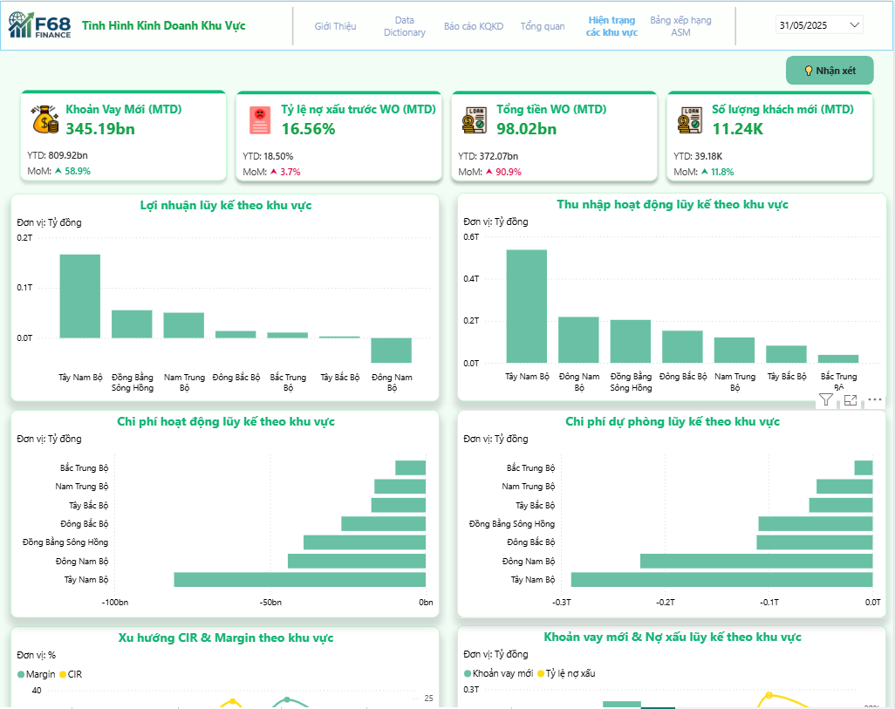
</kbd> 

<kbd>
  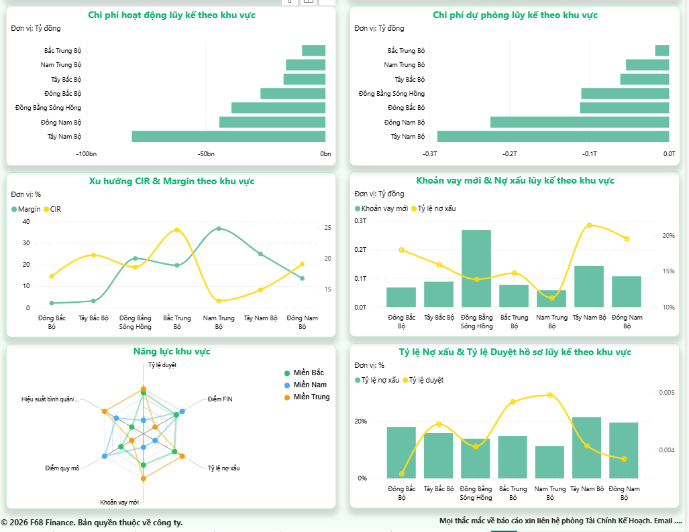
</kbd>  

**Mục tiêu thiết kế**  
- Cụm Thẻ KPI Khu vực (MTD): Tôi trình bày các chỉ số Khoản vay mới, Nợ xấu và Khách hàng mới ngay trên cùng để sếp có cái nhìn tổng quát về quy mô tăng trưởng và rủi ro của toàn hệ thống trong tháng.
- Biểu đồ Lợi nhuận & Thu nhập lũy kế: Tôi sắp xếp thứ tự các vùng theo hiệu quả kinh doanh từ cao đến thấp. Ý đồ của tôi là giúp sếp nhận diện nhanh chóng các đơn vị 'đầu tàu' và các khu vực cần được hỗ trợ kịp thời.
- Biểu đồ Chi phí vận hành & Dự phòng: Tôi tách riêng các khoản mục chi phí sang biểu đồ cột ngang. Cách này giúp tôi làm nổi bật sự khác biệt giữa doanh thu và chi phí, giúp sếp đối chiếu ngân sách khách quan và hạn chế nhầm lẫn khi đọc nhanh.
- Xu hướng CIR & Margin theo khu vực: Tôi sử dụng các đường biểu đồ này để phân tích sự biến động của hiệu quả vận hành giữa các vùng. Mục tiêu của tôi là xác định các mô hình có Margin cao và chi phí thấp để chúng ta có thể nghiên cứu nhân rộng.
- Khoản vay mới & Nợ xấu lũy kế: Tôi thiết kế biểu đồ này để đối soát mối tương quan giữa doanh số giải ngân và chất lượng nợ. Tôi muốn đảm bảo rằng tiến độ tăng trưởng của từng vùng luôn đi đôi với việc kiểm soát rủi ro tín dụng chặt chẽ.
- Biểu đồ Radar Năng lực khu vực: Đây là phần tôi dùng để đánh giá năng lực 360 độ của từng địa bàn. Thay vì chỉ nhìn doanh thu, tôi muốn sếp thấy được cả tỷ lệ duyệt hồ sơ và năng suất nhân sự. Vùng nào có hình mạng nhện càng cân đối thì chứng tỏ nơi đó đang quản trị rất bền vững.
- Tỷ lệ Nợ xấu & Tỷ lệ Duyệt hồ sơ: Tôi đặt hai chỉ số này sát nhau để phân tích tác động của chính sách thẩm định lên chất lượng nợ. Ý đồ của tôi là làm cơ sở để chúng ta điều chỉnh linh hoạt quy trình phê duyệt tùy theo đặc thù của từng khu vực.

**Nhận xét**  
- Kết quả cho thấy sự chênh lệch rõ rệt về hiệu quả giữa các khu vực địa lý. Trong khi Tây Nam Bộ đang là đơn vị đóng góp lợi nhuận lớn nhất cho hệ thống, khu vực Đông Nam Bộ lại ghi nhận tình trạng thâm hụt kết quả kinh doanh.
- So sánh giữa các biểu đồ Lợi nhuận và Thu nhập, có thể thấy một số vùng có doanh thu cao nhưng chi phí vận hành cũng tương ứng lớn, dẫn đến biên lợi nhuận thực tế chưa đạt kỳ vọng.
- Chỉ số Nợ xấu (NPL) toàn hệ thống tăng 3.7% và đặc biệt là Tiền xóa nợ (Write-off) tăng đột biến 90.9% là những tín hiệu rủi ro trọng yếu. Xu hướng này cho thấy chất lượng danh mục nợ cũ đang có dấu hiệu suy giảm mạnh, gây áp lực trực tiếp lên lợi nhuận ròng.
- Tại một số vùng trọng điểm, đường nợ xấu có xu hướng tỉ lệ thuận với quy mô giải ngân mới, phản ánh việc nới lỏng tiêu chuẩn phê duyệt để đạt chỉ tiêu doanh số.
- Biểu đồ mạng nhện cho thấy năng lực quản trị của miền Bắc và miền Trung có sự đồng đều và ổn định cao hơn khu vực miền Nam. Miền Nam mặc dù dẫn đầu về quy mô giải ngân (Điểm quy mô) nhưng lại gặp hạn chế về điểm kiểm soát rủi ro và hiệu suất nhân sự.

**Đề xuất giải pháp**  
- Cần ưu tiên xử lý các "điểm nóng" về nợ xấu tại các vùng có tỷ lệ nPL vượt ngưỡng an toàn (trên 18%).
- Hiệu quả kinh doanh của Tây Nam Bộ nên được nghiên cứu như một mô hình vận hành mẫu để áp dụng cho các khu vực đang có chi phí cao.
- Việc tăng trưởng quy mô phải được đặt trong mối tương quan chặt chẽ với khả năng thu hồi nợ và điểm tín dụng đầu vào.

#### Trang Bảng xếp hạng ASM
<kbd>
  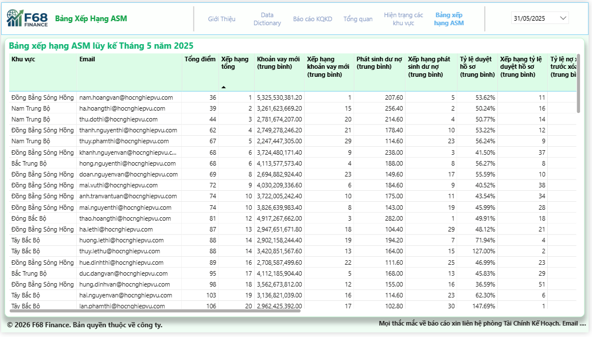
</kbd>   

**Mục tiêu thiết kế**  
- Bảng xếp hạng ASM lũy kế: Tôi thiết kế trang này như một 'bảng vàng' thành tích của đội ngũ ASM trên toàn quốc. Ý đồ của tôi là minh bạch hóa toàn bộ dữ liệu hiệu suất của từng cá nhân để sếp có cái nhìn công bằng nhất về năng lực của đội ngũ quản lý.

